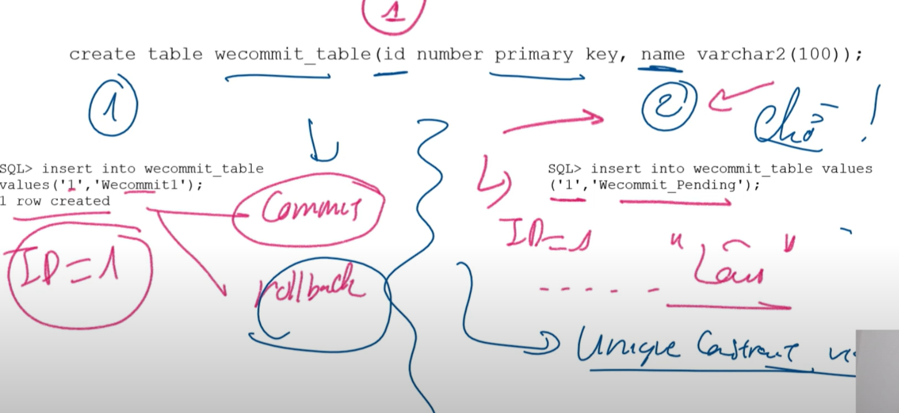
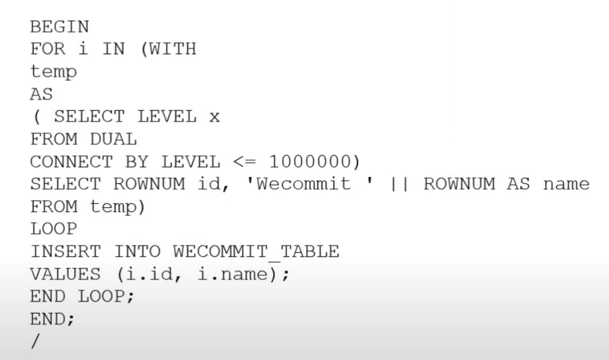
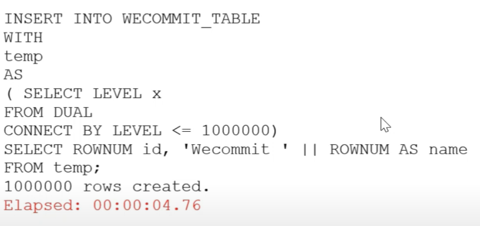

# 🚀 Getting Started

**Optimize Database Note**

## Optimize insert processing a large record in production database systems
### Step 1: Check lock

--- Locks are mechanisms that prevent concurrent access. It is triggered when using DML statements.
--- When two record insert use transactions, locking is triggered and will locking the second record and only opening when first record commit or rollback

### Step 2: Check trigger (Insert Log)

--- If any statement that needs to be executed fails before the insert statement is executed into the table, the insert statement will have to wait.

### Step 3: Check loop

--- Use loop when insert a large record will make slower

--- Not should

--- Should

### Step 4: Check commit frequency

--- Commit small data is faster than commit large data
--- In loop, commit before end loop make faster

### Step 5: Attach another statement | Too many indexes | Constraint

--- The insert statement is attached to the select statement.

