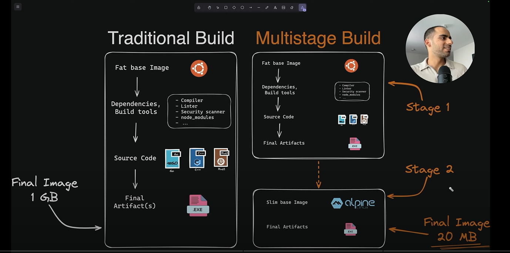

# 🚀 Docker notebook

**🌐 Docker notebook with good strategies 🌐**

## Reducing the size of docker image
1. Using multistate building
--- Remove all unnecessary data and get final image size for execution
--- This is traditional building and multistate building


### From this:
```dockerfile
FROM php:8.1-fpm

# Install dependencies
RUN apt-get update && apt-get install -y \
    git \
    curl \
    libpng-dev \
    libonig-dev \
    libxml2-dev \
    zip \
    unzip

# Install PHP extensions
RUN docker-php-ext-install pdo_mysql mbstring exif pcntl bcmath gd

# Install Composer
RUN curl -sS https://getcomposer.org/installer | php -- --install-dir=/usr/local/bin --filename=composer

WORKDIR /var/www/html
```
### To this:
```dockerfile
FROM php:8.1-fpm AS builder

# Install dependencies
RUN apt-get update && apt-get install -y --no-install-recommends \
    git \
    curl \
    libpng-dev \
    libonig-dev \
    libxml2-dev \
    zip \
    unzip \
    && rm -rf /var/lib/apt/lists/*

# Install PHP extensions
RUN docker-php-ext-install pdo_mysql mbstring exif pcntl bcmath gd

# Install Composer
RUN curl -sS https://getcomposer.org/installer | php -- --install-dir=/usr/local/bin --filename=composer

# Copy necessary files to the final stage
FROM php:8.1-fpm-slim

# Copy compiled PHP extensions and Composer
COPY --from=builder /usr/local/bin/composer /usr/local/bin/composer
COPY --from=builder /usr/lib/php /usr/lib/php
COPY --from=builder /usr/include/php /usr/include/php

WORKDIR /var/www/html

CMD ["php-fpm"]
```

2. Using less layer to run command

### From this:
```dockerfile
RUN apt-get update -y
RUN apt-get upgrade -y
RUN apt-get install vim -y
RUN apt-get install jq -y
```

### To this:
```dockerfile
RUN apt-get update -y && \
  apt-get upgrade -y && \
  apt-get install vim -y && \
  apt-get install jq -y
```